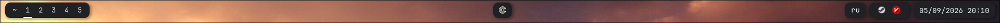

# Minimal Ironbar for Hyprland

A clean and minimal Ironbar configuration for Hyprland.

## Features

- Minimal top bar
- Hyprland workspace switcher
- Named `~` workspace
- Active workspace indicator
- Keyboard layout indicator
- System tray
- Battery indicator
- Clock
- Compact dark UI
- No external scripts required

## Requirements

- Hyprland
- Ironbar
- JetBrainsMono Nerd Font

## Installation

Clone the repository:

    git clone https://github.com/CEHZOI/ironbar-hyprland-minimal.git
    cd ironbar-hyprland-minimal

Copy the configuration:

    mkdir -p ~/.config/ironbar
    cp config.json ~/.config/ironbar/config.json
    cp style.css ~/.config/ironbar/style.css

Start Ironbar:

    ironbar

## Workspace `~`

This configuration uses a named Hyprland workspace called `~`.

If you do not use this workspace, remove `~` from:

    "favorites": ["~", "1", "2", "3", "4", "5"]

## Customization

Edit `style.css` to change colors, spacing, shadows and module appearance.

## Tested on

- CachyOS
- Hyprland
- Wayland
- Ironbar 0.19.x
